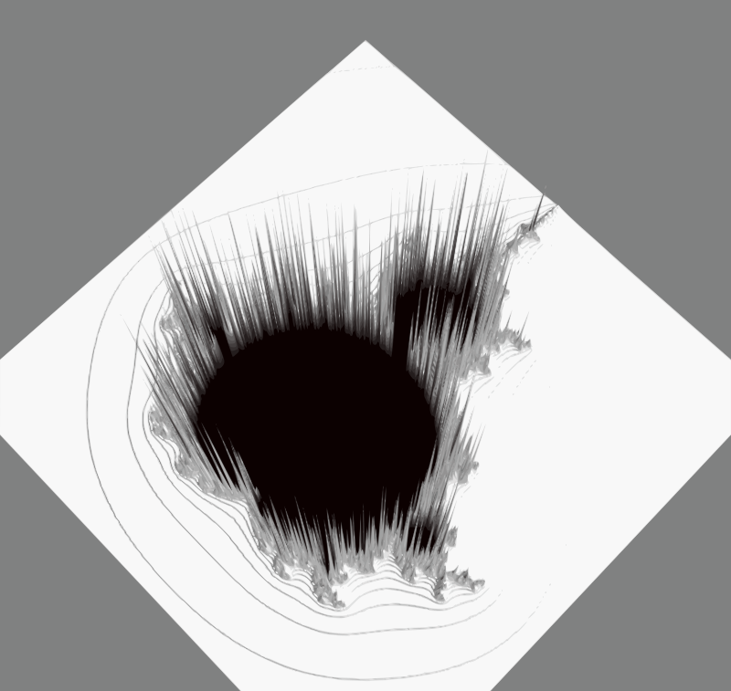
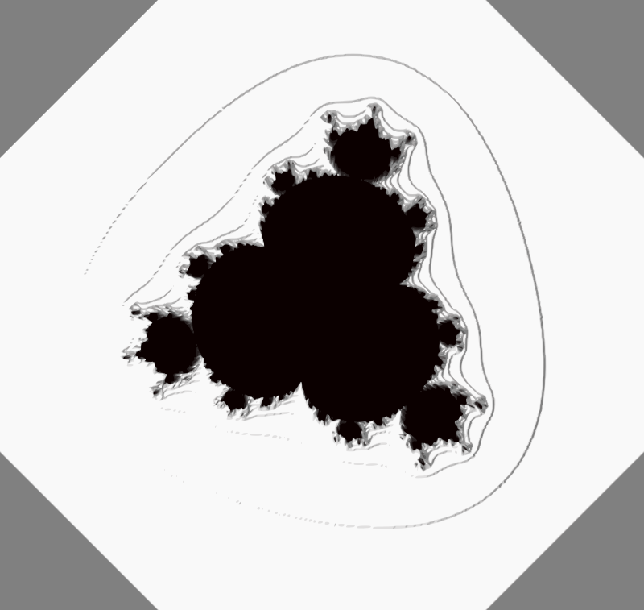

Let's play with the Mandelbrot equation
------------------------------------------------

+--------------------+---------------------+--------------------+
|                    |                     |                    | 
|    |3d_vision|     |    |3d_transform|   |     |puiss4|       |
|                    |                     |                    |
+--------------------+---------------------+--------------------+

.. |3d_transform| image:: ../../_images/3d_transform.svg

.. toctree::
    :caption: The mandelbrot set transformed
    
    3d_vision
    3d_transform
    power_iterates

